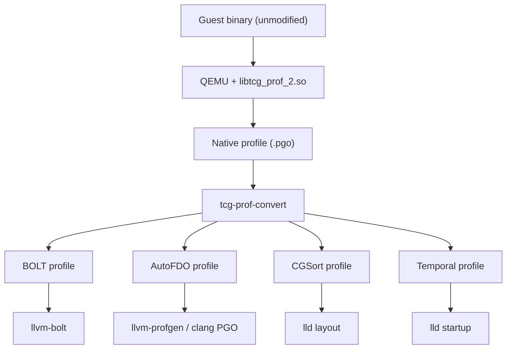

# qemu-profiler

A QEMU TCG plugin and profile converter for collecting Profile-Guided
Optimization (PGO) data from emulated guest binaries. Written in Rust.

Profile any unmodified guest binary -- Hexagon, RISC-V, AArch64, or
others -- on any QEMU host, then feed the results into LLVM BOLT,
AutoFDO, lld call-graph ordering, or startup temporal profiling.

## Branches

**main**: Primary development branch. Contributors should develop submissions based on this branch, and submit pull requests to this branch.

## The problem

PGO tools like BOLT and AutoFDO need execution profiles. The standard
way to collect them is `perf record -b` on the target hardware. But the
target hardware does not always exist:

- **Pre-silicon development**: the chip is not back from the fab yet.
- **Embedded/DSP targets**: Hexagon, specialized RISC-V cores, or other
  architectures with no Linux `perf` infrastructure.
- **CI environments**: reproducible profiles should not depend on
  hardware labs or flaky sampling.

Instrumentation PGO (`-fprofile-generate`) avoids the hardware
requirement but still requires an execution environment for the target
architecture, changes binary layout between the profiling and optimized
builds, and forces a two-phase build.

## How qemu-profiler solves it

Load `libtcg_prof_2.so` as a QEMU plugin. It hooks into TCG's
translation-block lifecycle and instruments every TB at JIT compile time.
At program exit, a native binary profile is written. A separate
converter tool transforms it into the format each tool expects.



No recompilation. No target hardware. Consistent output -- same
binary plus same input always produces similar profiles.

## Requirements

- Rust toolchain (stable, edition 2021) with `cargo`
- A QEMU build with TCG plugin support (QEMU 9.0+ for API v2, QEMU 11.0+
  for API v6 / tier 3)
- Optionally, cross-compilers for guest architectures if you want to
  build the integration test fixtures (e.g. `hexagon-unknown-linux-musl-clang`,
  `riscv64-linux-gnu-gcc`, `aarch64-linux-gnu-gcc`)
- Downstream PGO consumers as needed: `llvm-bolt`, `llvm-profgen`,
  `ld.lld`, or GCC's `create_gcov`

## Installation Instructions

```bash
git clone https://github.com/qualcomm/qemu-profiler.git
cd qemu-profiler

# Build both plugin variants and the converter:
cargo build --release -p qemu-pgo-plugin --features tier3
cp target/release/libtcg_prof.so target/release/libtcg_prof_6.so
cargo build --release -p qemu-pgo-plugin
cp target/release/libtcg_prof.so target/release/libtcg_prof_2.so

# Produces:
#   target/release/libtcg_prof_2.so   (API v2, tiers 0-2, QEMU 9.0+)
#   target/release/libtcg_prof_6.so   (API v6, all tiers, QEMU 11.0+)
#   target/release/tcg-prof-convert   (converter)
```

Or use the provided `Makefile`, which builds both variants in one step:

```bash
make
```

To build only one variant:

```bash
cargo build --release -p qemu-pgo-plugin                    # API v2 (tiers 0-2)
cargo build --release -p qemu-pgo-plugin --features tier3   # API v6 (all tiers)
```

## Usage

### Profile a guest binary

```bash
# Tier 1 (edges) -- suitable for BOLT, AutoFDO, lld CGSort
qemu-system-riscv32 -M virt -nographic -bios none \
    -plugin ./target/release/libtcg_prof_2.so,tier=edges,output=profile.pgo \
    -kernel ./guest_binary

# Tier 0 (hotness) -- lowest overhead, enough for temporal profiling
qemu-system-riscv32 -M virt -nographic -bios none \
    -plugin ./target/release/libtcg_prof_2.so,tier=hotness,output=profile.pgo \
    -kernel ./guest_binary

# Tier 2 (calls) -- adds call graph with indirect call targets
qemu-system-riscv32 -M virt -nographic -bios none \
    -plugin ./target/release/libtcg_prof_2.so,tier=calls,output=profile.pgo \
    -kernel ./guest_binary
```

### Convert and optimize

**BOLT** -- reorder basic blocks and functions for I-cache locality:

```bash
tcg-prof-convert bolt -i profile.pgo -b guest_binary -o bolt.txt
llvm-bolt ./guest_binary -o ./guest_binary.bolt -pa -p bolt.txt
```

**AutoFDO** -- sample PGO for clang inlining, unrolling, register
allocation:

```bash
tcg-prof-convert autofdo -i profile.pgo -b guest_binary -o autofdo.txt
llvm-profgen --unsymbolized-profile=autofdo.txt --binary=guest_binary \
    -o prof.data
clang -fprofile-sample-use=prof.data -O2 -c source.c
```

**CGSort** -- lld function layout via C3 algorithm:

```bash
tcg-prof-convert cgsort -i profile.pgo -b guest_binary -o cg.txt
ld.lld --call-graph-ordering-file=cg.txt ...
```

**Temporal** -- startup function ordering to reduce page faults:

```bash
tcg-prof-convert temporal -i profile.pgo -b guest_binary -o temporal.txt
# Merge into instrprof, then:
lld --irpgo-profile=temporal.merged --bp-startup-sort=function ...
```

**Debug dump**:

```bash
tcg-prof-convert dump -i profile.pgo
```

## Plugin options

| Option | Values | Default | Description |
|--------|--------|---------|-------------|
| `tier` | `hotness`, `edges`, `calls`, `resources` | `edges` | Profiling detail level (0-3) |
| `output` | file path | `profile.pgo` | Output file path |
| `stream` | `on`, `off` | `off` | Periodic flush for long workloads |
| `top_n` | integer | 65536 | Max edges in bounded mode |
| `binary` | file path | auto-detect | Guest binary path |

## QEMU compatibility

* `libtcg_prof_2.so` declares version 2 and requires QEMU 9.0 or later.
* `libtcg_prof_6.so` declares version 6 and requires QEMU 11.0 or later.

Use `libtcg_prof_2.so` for tiers 0-2 on QEMU 9.0+. Use
`libtcg_prof_6.so` when tier 3 (resources) is needed on QEMU 11.0+.

## How it works

### Tiered instrumentation

Each tier includes all data from lower tiers.

**Tier 0 - Hotness.** Registers an inline `ADD` on each translation
block's per-vCPU scoreboard to count executions. A conditional callback
fires on first execution to assign a monotonic sequence number, enabling
temporal ordering of startup code.

**Tier 1 - Edges.** Exploits QEMU's in-order callback execution to
detect branches. A conditional callback fires at TB entry when the
previous TB did not fall through sequentially (i.e., a branch was
taken). The callback reads the previous TB's end address from the
per-vCPU scoreboard and records the edge. Fall-through counts are
derived at exit: `fall_through = total_exec - branch_entries`.

**Tier 2 - Calls.** Direct calls are discovered at translation time by
parsing disassembly for call mnemonics (architecture-specific patterns
for Hexagon, ARM, x86, RISC-V). Indirect calls use a scoreboard relay:
the indirect call instruction stores its address to
`pending_indirect_callsite`, and the next TB's branch callback pairs it
with the actual target address.

**Tier 3 - Resources.** Classifies TBs by coprocessor usage (HVX, HMX,
FP) via disassembly pattern matching. In system emulation mode, tracks
MMIO device accesses and discontinuity events (interrupts, exceptions).

## Comparison with other approaches

### vs. hardware sampling (`perf record -b`)

Hardware sampling via LBR (x86) or BRBE (AArch64) is the gold standard
when you have the target hardware. It captures real microarchitectural
effects. **Use it when you can.**

qemu-profiler exists for when you cannot: cross-architecture targets,
pre-silicon, embedded cores without `perf`, or CI without hardware labs.
The tradeoff is no microarchitectural fidelity - no cache miss data, no
real branch misprediction counts.

### vs. instrumentation PGO (`-fprofile-generate`)

Instrumentation PGO gives exact edge counts but requires recompilation
and still requires an execution environment for the target architecture.
Counter layout is compiler-internal and tied to a specific build.

qemu-profiler works on unmodified release binaries. One profiling run
produces data for BOLT, AutoFDO, CGSort, and temporal profiling
simultaneously - no recompilation at all.

### vs. simulation (hexagon-sim, gem5, Spike)

Simulators produce simulator-specific trace formats that require custom
conversion. They are designed for verification and cycle-accuracy, not
PGO workflow integration.

qemu-profiler writes directly to formats that tools consume.

### Summary

| | Hardware sampling | Instrumentation PGO | qemu-profiler | Simulation |
|-|-------------------|---------------------|----------------|------------|
| Requires target HW | Yes | Execution env | No | No |
| Requires recompilation | No | Yes | No | No |
| Microarch fidelity | Yes | No | No | Varies |
| Multi-format output | One at a time | Compiler-specific | All from one run | Custom |
| Cross-architecture | No | No | Yes | Per-simulator |

## Converter compatibility

| Converter | Consumer tool | Min tier |
|-----------|--------------|----------|
| `bolt` | `llvm-bolt` | 1 (edges) |
| `autofdo` | `llvm-profgen` then clang | 1 (edges) |
| `cgsort` | `ld.lld --call-graph-ordering-file` | 1 (best: 2) |
| `temporal` | `llvm-profdata` then lld | 0 (hotness) |
| `gcc-autofdo` | `create_gcov` then GCC | 1 (edges) |

## Current limitations

- **Single-binary model.** The entire pipeline - plugin, profile
  format, and converter - assumes all profiled code comes from one
  statically-linked binary. The plugin records one binary path and one
  `text_start`/`text_end` range (the main executable's). The converter
  loads one ELF file for symbol resolution. Any code outside the main
  binary (shared libraries, dynamically loaded code) is profiled at the
  raw virtual address level but cannot be attributed to symbols. The
  BOLT and AutoFDO emitters compute offsets relative to the main
  binary's load address, producing incorrect offsets for addresses that
  belong to other loaded objects. The CGSort emitter silently drops
  call-graph edges where either endpoint resolves to `[unknown]`. For
  programs that spend significant time in shared libraries, this means
  a large fraction of the profile data is lost or misattributed.

- **Virtual address reuse.** Translation blocks are keyed by
  `(start_addr, n_insns)`. If code at a virtual address changes --
  due to `dlclose`/`dlopen`, JIT code generation, or self-modifying
  code - the plugin silently merges execution counts from the new code
  into the stale TB entry from the old code. The QEMU plugin API does
  not provide `mmap`/`munmap` notifications, and the plugin's
  flush callback (triggered on code cache invalidation) does not
  invalidate stale entries. There is no mechanism to detect that the
  code at an address has changed.

- **No branch misprediction data.** BOLT profiles emit `mispred=0`
  because QEMU does not model branch prediction. BOLT still benefits
  from edge frequency data, but cannot optimize for misprediction.

- **TB granularity != compiler BB granularity.** QEMU translation blocks
  may be split at page boundaries or by self-modifying code, producing
  edges that do not correspond to compiler basic block boundaries.

- **No full call stacks.** Only direct caller-callee pairs are captured
  (tier 2), not complete call chains. This prevents CSSPGO
  (context-sensitive sample PGO) support.

## Testing

```bash
# Unit tests (24 across plugin and convert)
cargo test

# Integration tests (21 across 6 modules)
# Requires target/release/libtcg_prof.so (or a renamed variant) and
# a QEMU linux-user binary. Tests skip gracefully when prerequisites
# are missing.
cargo test --package pgo-integration-tests

# Formatting and linting
cargo fmt -- --check
cargo clippy --all-targets
```

## Development

See [CONTRIBUTING.md](CONTRIBUTING.md) for how to submit changes, and
[CODE-OF-CONDUCT.md](CODE-OF-CONDUCT.md) for community guidelines.

## Getting in Contact

* [Report an Issue on GitHub](../../issues)
* [Open a Discussion on GitHub](../../discussions)

## License

qemu-profiler is licensed under the [BSD 3-Clause Clear License](https://spdx.org/licenses/BSD-3-Clause-Clear.html). See [LICENSE.txt](LICENSE.txt) for the full license text.
